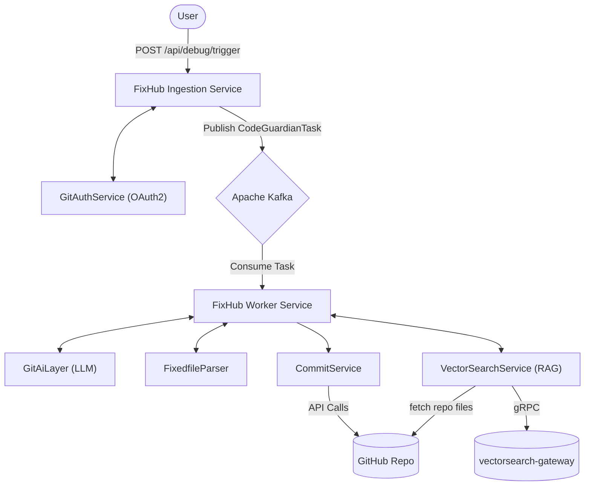
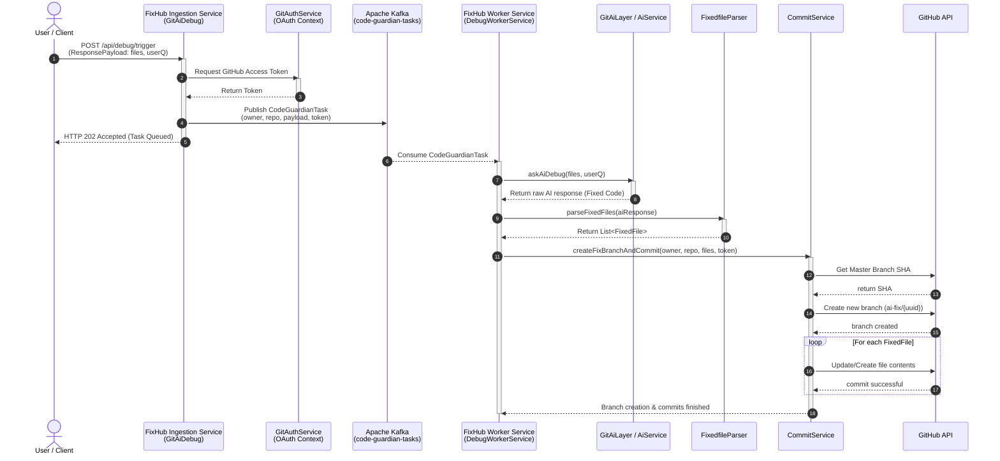

# 🛡️ Code Guardian — Distributed AI Code Debugger

Code Guardian is an AI-powered code debugging platform. It has been recently refactored from a monolithic Spring Boot application into a **true distributed microservice architecture** utilizing **Apache Kafka**.

The platform is designed to:
1) **Ingest** user requests containing broken `.java` files from a GitHub repository.
2) **Delegate** the heavy lifting of AI processing securely via Kafka.
3) **Analyze & Fix** the files using a backend worker service connected to a LLM.
4) **Commit** the fixed files back to GitHub on a new branch automatically.

---

## 📸 Screenshots / Media


| UI / Flow | Screenshot |
|---|---|
| Home / Dashboard |  |
| AI Result (diff view) |  |
| Commit Confirmation |  |

---

## 🧭 Architecture

The system is split into two distinct Spring Boot applications, each fulfilling a single responsibility:

1. **FixHub Ingestion Service**: Serves as the user-facing entry point. It receives debugging requests, authenticates the user, extracts the GitHub OAuth token, and pushes the work payload to Kafka.
2. **FixHub Worker Service**: Runs asynchronously in the background. It listens to Kafka, communicates with the AI to generate fixes, and commits those fixes to GitHub on the user's behalf. Before asking the AI, it retrieves semantically related files from the same repository via a self-built vector search stack (RAG) and includes them as read-only context; after a successful commit it re-indexes the repo's files so future tasks retrieve richer context.

### High-Level Flow


### API Call Sequence (End-to-End)



---

## 🛠️ Tech Stack

* Java 21+, Spring Boot 3+
* Apache Kafka (Message Broker)
* Spring AI (OpenAI Compatible API)
* Spring WebFlux (WebClient)
* Spring Security (OAuth2 Client)
* GitHub REST API v3
* gRPC (Java client) to a self-built vector search stack (RAG retrieval/indexing)
* Gradle

---

## ⚙️ Configuration

Ensure you have a running instance of **Apache Kafka** (e.g. locally via Docker on port 9092).

### Ingestion Service (`fixhub-ingestion-service/src/main/resources/application.properties`)

```properties
server.port=8080

# GitHub OAuth2 config required for authentication
spring.security.oauth2.client.registration.github.client-id=YOUR_CLIENT_ID
spring.security.oauth2.client.registration.github.client-secret=YOUR_CLIENT_SECRET

# Kafka
spring.kafka.bootstrap-servers=localhost:9092

```

### Worker Service (`fixhub-worker-service/src/main/resources/application.properties`)

```properties
server.port=8081

# Kafka
spring.kafka.bootstrap-servers=localhost:9092
spring.kafka.consumer.group-id=code-guardian-group
spring.kafka.consumer.auto-offset-reset=earliest

# AI
spring.ai.openai.api-key=YOUR_API_KEY
spring.ai.openai.base-url=[https://api.openai.com](https://api.openai.com)
spring.ai.openai.chat.options.model=gpt-fixit

# Vector Search Gateway (RAG) - optional; if unreachable, RAG context is
# skipped and the worker falls back to today's plain (non-RAG) behavior.
vectorsearch.gateway.host=localhost
vectorsearch.gateway.port=50053

```

**Token scopes**: at minimum `repo` (private repos) or `public_repo` (public), plus `contents:write` to commit code.

**RAG stack (optional)**: the worker service retrieves and indexes repository
context through a separately-run [`vectorsearch-gateway`](https://github.com/Razeefshaik/vectorsearch-gateway)
(gRPC `Gateway` service, port `50053` by default), which in turn talks to its
embedding services, Kafka, and a `VectorSearch` coordinator backed by a
from-scratch HNSW engine. None of that stack lives in this repo; if it isn't
running, `DebugWorkerService` simply proceeds without related-file context.

---

## 🚀 Build & Run

### 1. Build Both Microservices

```bash
cd fixhub-ingestion-service
./gradlew build

cd ../fixhub-worker-service
./gradlew build

```

### 2. Start the Applications

You must run both services alongside Kafka.

**Run Ingestion Service:**

```bash
cd fixhub-ingestion-service
./gradlew bootRun

```

**Run Worker Service:**

```bash
cd fixhub-worker-service
./gradlew bootRun

```

---

## 🔌 REST API

**Base URL**: `http://localhost:8080` (Ingestion Service)

### Submit a Debugging Task

`POST /api/debug/trigger`

This endpoint queues a debugging task to Kafka.

**Body:**

```json
{
  "userQ": "Fix NPEs, rename unclear variables, add null checks",
  "files": [
    {
       "path": "src/main/java/com/example/App.java", 
       "content": "public class App { ... }" 
    }
  ]
}

```

**Response:**

`202 Accepted` - "Task accepted and sent to worker queue"

*(The worker service will asynchronously pick up this task, send it to the AI, and commit the fixes directly to a new branch in your repository!)*

---

## 🧱 Project Structure

```
CodeGuardian/
 ├── fixhub-ingestion-service/
 │    ├── build.gradle
 │    └── src/main/java/com/razeef/bugbrother/
 │         ├── controllers/
 │         │    └── GitAiDebug.java (Kafka Producer)
 │         ├── config/
 │         │    └── Oauth.java
 │         ├── models/
 │         │    ├── CodeGuardianTask.java
 │         │    └── ResponsePayload.java
 │         └── services/
 │             └── GitAuthService.java
 │
 ├── fixhub-worker-service/
 │    ├── build.gradle
 │    ├── src/main/proto/            (coordinator.proto, gateway.proto)
 │    └── src/main/java/com/razeef/bugbrother/
 │         ├── config/
 │         │    └── VectorSearchConfig.java (gRPC channel/stub)
 │         ├── services/
 │         │    ├── DebugWorkerService.java (Kafka Consumer)
 │         │    ├── GitHubService.java
 │         │    ├── VectorSearchService.java (RAG retrieval/indexing)
 │         │    ├── AiService.java
 │         │    └── CommitService.java
 │         ├── parsers/
 │         │    └── FixedfileParser.java
 │         └── Wrappers/
 │             └── GitAiLayer.java
 │
 └── docs/
     └── media/

```

---

## 🤝 Contributing

1. Fork the repository
2. Create a feature branch (`git checkout -b feat/my-new-idea`)
3. Commit your changes (`git commit -m 'feat: Add some amazing feature'`)
4. Push to the branch (`git push origin feat/my-new-idea`)
5. Open a Pull Request

---

## 📜 License

This project is licensed under the **MIT License**.

```

```
