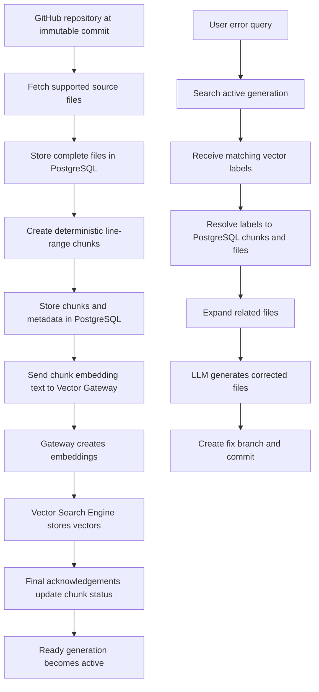

# BugBrother Improvements and Technical Debt

This document records known limitations, risks, and future improvements discovered while rebuilding BugBrother. It is a planning reference. A listed improvement should not be treated as implemented until it is moved to the completed section with verification evidence.

## Current architecture



Each index generation represents one immutable repository commit. Files and chunks from different commits must never be mixed in the same generation.

## 1. Full repository reindex after every merged change

### Current design

When a branch moves from Commit A to Commit B, BugBrother creates a complete new generation:

```text
Commit A -> Generation 1 -> RETIRED
Commit B -> Generation 2 -> READY and ACTIVE
```

Generation 2 fetches, stores, chunks, embeds, and indexes the entire supported codebase, including unchanged files.

### Drawbacks

- Unchanged files are downloaded and stored again.
- Unchanged chunks are embedded again.
- More Kafka messages and vector insert operations are produced.
- Indexing time grows with repository size instead of change size.
- PostgreSQL and vector storage temporarily contain multiple complete repository copies.
- Frequent commits can create an indexing backlog.
- Embedding API or compute costs are repeated for identical content.

### Future improvement: incremental generation building

Compare the previous active commit with the new commit using GitHub's commit comparison or Git tree APIs.

```text
Unchanged file -> reuse content and chunk information
Changed file   -> create new chunks and vectors
New file       -> create new chunks and vectors
Deleted file   -> exclude it from the new generation
Renamed file   -> detect rename and decide whether vectors can be reused
```

The resulting generation must still behave like a complete immutable snapshot. Searches must use exactly one generation.

### Required vector-platform improvement

Every generation currently receives a different `vectorClientId`. Therefore, vectors belonging to Generation 1 cannot be referenced directly by Generation 2.

Possible solutions:

1. Add a server-side `CopyVectors` operation that copies unchanged vectors into the new client namespace.
2. Cache embeddings by model ID plus embedding-text hash, then insert cached vectors under the new generation's labels.
3. Use a stable repository client ID and encode the generation into labels or metadata, provided the engine can filter strictly by generation.

Embedding caching is likely the safest first optimization because generations remain isolated while repeated model work is avoided.

## 2. Detecting repository changes

### Current limitation

The selected branch can move after its generation becomes active. BugBrother must not silently debug an older commit while the user expects the latest code.

### Required behavior

Whenever a repository is selected or a debug task starts:

1. Resolve the selected branch to its current commit SHA.
2. Read the active generation's commit SHA.
3. Compare the two SHAs.
4. If they differ, report that the index is stale and create a new generation.

### Future automation

Add verified GitHub webhooks for push and merge events:

```text
GitHub push or merge
        -> verify webhook signature
        -> resolve new branch head
        -> create generation
        -> index and validate
        -> atomically activate new generation
```

Webhook deliveries must be idempotent because GitHub can retry the same delivery.

## 3. Fix branch and merge lifecycle

### Current limitation

Creating a fix commit does not mean the target branch has changed. The user may reject, edit, or never merge the fix branch.

### Required behavior

- Create the fix branch from the exact `baseCommitSha` used by the debug task.
- Check that the target branch still points to that SHA before creating the branch.
- If the branch moved, stop and ask the user to rerun debugging against the latest commit.
- Do not activate a new main-branch generation merely because a fix branch was created.
- Reindex the target branch after the fix is actually merged.

### Current commit implementation problems

- It assumes the target branch is named `main` instead of using the selected branch.
- It commits files one at a time through the Contents API, producing multiple commits and allowing a partially committed fix.
- A failure after some files are committed leaves an incomplete branch.
- It does not verify that returned paths are inside the repository or belong to the allowed correction set.
- It does not verify the branch head against `baseCommitSha` immediately before writing.
- It does not return and persist the resulting branch name, commit SHA, and URL reliably.
- It catches some GitHub failures after partial work instead of making the write atomic.

### Future improvement

Use the Git data API to create one tree and one commit containing every corrected file, then create or update the fix branch once. Store the resulting branch, commit SHA, and URL in the task result.

## 4. Active and retired generation lifecycle

### Current behavior

The previous active generation remains usable while a replacement is building. Activation happens only after every chunk in the new generation is confirmed. The previous generation then becomes `RETIRED`.

### Missing improvement

Retired generations are not yet removed automatically. Without retention cleanup, PostgreSQL and vector storage will grow continuously.

### Future retention job

1. Keep retired generations for a configurable period, such as seven days.
2. Ensure no running task references the generation.
3. Change it to a cleanup state.
4. Delete every vector using its stored labels.
5. Confirm deletion.
6. Delete its PostgreSQL generation, files, and chunks.

Retention should be configurable by repository size, available storage, and audit requirements.

## 5. Retrieval still uses the legacy model

### Current limitation

The existing debug worker's `searchRelated` method predates generation-based indexing. It:

- Derives a client ID from `owner/repository` instead of using the active generation's `vectorClientId`.
- Treats vector labels as file-path hashes, although Phase 4 labels identify chunks.
- Fetches current files from GitHub to resolve results instead of using the immutable PostgreSQL manifest.
- Can accidentally compare search results with code from a different commit.
- Does not preserve vector scores or explain why a file was selected.

### Phase 5 replacement

```text
Resolve active READY generation
        -> search with its vectorClientId
        -> receive vector labels and scores
        -> resolve labels to stored chunks
        -> group chunks by source file
        -> load immutable file contents from PostgreSQL
        -> expand related files with controlled limits
        -> build one ContextBundle
```

The worker should never retrieve current GitHub contents to resolve search results from an older immutable generation.

## 6. Chunk retrieval and file reconstruction

### Current limitation

Vector search returns chunks, while the fixing LLM usually needs coherent files and surrounding definitions.

### Required improvement

- Deduplicate repeated vector labels.
- Preserve distances or similarity scores.
- Group chunks by file.
- Merge overlapping or neighboring line ranges.
- Load the complete stored file when required.
- Distinguish primary error-related files from supporting read-only files.
- Record a selection reason for every file.

Example:

```text
UserService.java
  chunks: 40-75 and 70-110
  merged evidence range: 40-110
  reason: vector match

UserRepository.java
  reason: imported by UserService.java
```

## 7. Deterministic dependency graph

### Missing feature

There is not yet a complete deterministic source-code dependency graph. Vector similarity alone cannot reliably find all files required for a multi-file fix.

### Planned graph data

- File-to-file imports.
- Package or module declarations.
- Declared classes, interfaces, functions, and symbols.
- Inheritance and interface implementation.
- Referenced project-local symbols.
- Configuration and resource references where practical.

### Design rules

- Store graph nodes and edges per generation.
- Never cross generation boundaries during expansion.
- Expand breadth-first with a maximum depth.
- Record the edge that caused every added file.
- Use language-specific parsers when possible; regex parsing should be a fallback only.
- Handle ambiguous symbols explicitly rather than choosing an arbitrary file.

## 8. Iterative LLM context expansion

### Planned behavior

After vector retrieval and deterministic graph expansion, a context-planning LLM may request additional files or symbols.

```text
Initial vector matches
        -> deterministic dependencies
        -> LLM asks for missing path or symbol
        -> resolve only from the same generation
        -> repeat until sufficient or limit reached
```

### Required limits

- Maximum vector hits.
- Maximum candidate files.
- Maximum graph depth.
- Maximum LLM expansion rounds.
- Maximum total source characters or model tokens.
- Maximum single-file size.
- Allowed repository paths only.

The LLM should request files through structured output. It must not directly fetch GitHub paths or invent source content.

## 9. Selecting which files may be changed

### Current limitation

The fixing LLM can return any file path it chooses. Supporting context and editable files are not strongly separated.

### Required improvement

Create a `ContextBundle` with explicit roles:

```text
Primary files       -> likely editable
Supporting files    -> read-only context by default
Requested additions -> require validation before becoming editable
```

Before committing:

- Reject absolute paths and path traversal.
- Reject files outside the indexed repository.
- Reject duplicate paths.
- Require every changed existing file to match the indexed base content hash.
- Require the model to explain why each file changed.
- Apply a configurable maximum changed-file count.
- Permit new files only when the response declares them explicitly.

## 10. LLM output format and parsing

### Current problems

- The parser primarily expects Java markdown blocks.
- Multiple fallback parsers make malformed responses appear valid.
- Raw model responses are logged and may contain private source code.
- There is no strict schema for changed, unchanged, created, or deleted files.
- There is no patch-level validation before GitHub writes.

### Future improvement

Use structured JSON output validated against a schema, for example:

```json
{
  "changes": [
    {
      "path": "src/UserService.java",
      "operation": "UPDATE",
      "baseContentSha256": "...",
      "content": "...",
      "reason": "Handle a missing repository result"
    }
  ],
  "additionalContextRequests": []
}
```

Reject the entire response if any change fails schema, path, base-hash, size, or permission validation.

## 11. Validation before committing

### Missing feature

Generated code is currently committed without a reliable build or test validation stage.

### Planned improvement

1. Materialize the immutable base commit in an isolated workspace.
2. Apply all proposed changes together.
3. Run repository-specific formatting, compilation, and targeted tests.
4. Capture command output with time and size limits.
5. If validation fails, optionally give the errors back to the LLM for a bounded repair attempt.
6. Commit only after validation succeeds or the user explicitly accepts an unvalidated patch.

The worker must prevent arbitrary repository scripts from accessing host secrets or unrestricted infrastructure.

## 12. Vector insertion throughput and rate limiting

### Current limitation

The gateway token bucket is currently hard-coded with a capacity of 10 and a refill rate of one request per second. Large chunk submissions can exceed this limit. Cleanup already retries rate-limited deletes, but insertion needs a proper bulk strategy.

### Future improvement

- Make rate-limit settings configurable.
- Add bounded client-side insert retry with backoff and jitter.
- Consider a batch insert API.
- Separate search, insert, and delete quotas.
- Add retry-after information to rate-limit responses.
- Persist submission progress so a restarted worker does not unnecessarily resubmit confirmed chunks.

## 13. Index failure and cleanup durability

### Implemented foundation

- Pre-vector failures discard the incomplete PostgreSQL generation.
- The vector-submission boundary is persisted.
- Post-submission failures enter `CLEANING`.
- Cleanup commands are republished.
- Missing vectors count as successful idempotent deletion.
- PostgreSQL rows are deleted only after vector deletion succeeds.
- Worker timeout uses the persisted boundary to select the safe cleanup path.

### Future improvements

- Store per-label deletion progress to avoid restarting a very large cleanup from its first label after a worker crash.
- Add cleanup attempt count, last error, next retry time, and dead-letter state.
- Add metrics and alerts for generations stuck in `BUILDING` or `CLEANING`.
- Add an administrative retry endpoint.
- Add integration tests that kill the worker at each pipeline boundary.
- Add a maximum cleanup concurrency per vector client.

## 14. Task and event reliability

### Future improvements

- Use an outbox pattern so PostgreSQL state changes and Kafka publication cannot disagree.
- Make every command and status event explicitly versioned.
- Persist processed command IDs for worker-side idempotency.
- Add dead-letter topics for malformed or permanently failing events.
- Record retry count and the last failure.
- Prevent an old delayed event from changing a newer task state.
- Remove GitHub access tokens from long-lived Kafka payloads by using short-lived credentials or encrypted references.

## 15. Private repository and secret protection

### Risks

- Source code is stored in PostgreSQL.
- Source fragments are sent to the configured LLM provider.
- GitHub tokens currently travel in Kafka commands.
- Raw LLM responses may be logged.
- Operational logs may accidentally contain private code or credentials.

### Required improvements

- Encrypt sensitive database fields and backups.
- Never log source content, model responses, or tokens in production.
- Redact secrets before creating embeddings or LLM prompts.
- Add repository-level authorization to every public read endpoint.
- Keep internal APIs authenticated and isolated from public traffic.
- Use short-lived GitHub credentials where possible.
- Define source and vector retention policies.
- Record an audit trail for indexing, retrieval, generation, and GitHub writes.

## 16. Language support

### Current limitation

Some legacy parsing and prompting assumes Java even though indexing can store other text-based source files.

### Future improvement

- Detect language consistently during ingestion.
- Use language-aware chunking and syntax parsers.
- Generate correct fenced-code language identifiers.
- Add dependency extractors per supported language.
- Declare an explicit supported-language list.
- Treat unsupported files as read-only text context or exclude them predictably.

## 17. Observability

Add metrics for:

- Generation build duration.
- Files and chunks per generation.
- Vector submission and acknowledgement latency.
- Failed and cleaning generations.
- Cleanup attempts and deleted labels.
- Vector search latency and degraded shard responses.
- Context files and tokens per debug task.
- LLM expansion rounds.
- Validation duration and outcome.
- GitHub commit success and failure.

Use the same task ID, generation ID, event ID, and correlation ID across structured logs. Do not include private source code in those logs.

## 18. Testing still required

### Unit tests

- Active generation resolution.
- Vector-label-to-chunk mapping.
- Chunk grouping and range merging.
- Dependency graph extraction and traversal limits.
- Context size enforcement.
- LLM response schema and path validation.
- Base content hash verification.
- Cleanup state transitions.

### Integration tests

- PostgreSQL manifest plus vector result acknowledgement.
- Separate workflow and vector Kafka brokers.
- Partial vector insertion followed by cleanup.
- Worker crash before and after the submission boundary.
- Duplicate commands and acknowledgements.
- Generation activation while the previous generation serves searches.
- Stale branch detection before committing.
- Atomic multi-file GitHub commit behavior.

### End-to-end tests

- Index a private test repository.
- Submit a multi-file error.
- Retrieve chunks and dependency files from the correct generation.
- Generate, validate, and commit a fix branch.
- Merge the branch and build the replacement generation.
- Retire and eventually clean the old generation.

## Recommended implementation order

1. Replace legacy retrieval with active-generation chunk retrieval.
2. Build chunk grouping and immutable PostgreSQL file resolution.
3. Add deterministic dependency graph extraction.
4. Add bounded LLM context expansion and `ContextBundle`.
5. Add strict structured fix output and changed-file validation.
6. Replace per-file GitHub commits with one atomic tree commit.
7. Add isolated build and test validation.
8. Detect stale branch heads before writing.
9. Add post-merge reindex detection and GitHub webhooks.
10. Add retired-generation retention cleanup.
11. Add embedding caching and incremental generation building.
12. Add outbox, dead-letter handling, security hardening, metrics, and full integration tests.

## Completed foundations

- Immutable commit-based source fetching.
- Deterministic chunk creation.
- Complete files and chunks stored in PostgreSQL.
- Generation-specific vector client isolation.
- Per-chunk submission correlation.
- Final vector acknowledgement tracking.
- Atomic activation of a completely indexed generation.
- Previous active generation remains available during replacement indexing.
- Safe cleanup distinction before and after vector submission.
- Idempotent gateway deletion for failed generation cleanup.

