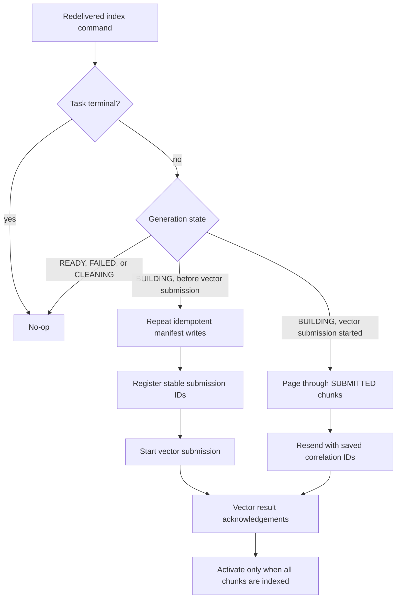

# Task delivery and indexing recovery

This describes the current BugBrother workflow on `master`. The gateway and
engine remain on their BugBrother feature branches.

## Command delivery

```mermaid
sequenceDiagram
    participant UI
    participant Ingestion
    participant PG as PostgreSQL
    participant Relay as Outbox relay
    participant Kafka
    participant Worker
    UI->>Ingestion: Start index or debug task
    Ingestion->>PG: One transaction: task + command outbox row
    Ingestion-->>UI: Task ID (queued)
    loop Until Kafka acknowledges or task becomes terminal
        Relay->>PG: Lock due outbox row
        Relay->>Kafka: Publish original command and event ID
        Kafka-->>Relay: Acknowledged
        Relay->>PG: Mark published; erase command payload
    end
    Kafka->>Worker: Deliver command, possibly more than once
    Worker->>Ingestion: Read authoritative task state
    Worker-->>Kafka: Return only after processing or safe no-op
```

The outbox closes the task/database-to-Kafka crash gap. A relay crash after
Kafka accepts the command but before PostgreSQL records success can cause a
duplicate command. The worker therefore checks terminal task state first and
its side effects are replay-safe. The outbox payload contains the command's
GitHub token until publication succeeds, then is cleared. Protect PostgreSQL
and its backups accordingly; replacing token payloads with encrypted credential
references remains separate security work.

## Index worker replay

Before vector submission, file and chunk manifest writes are idempotent.
Submission IDs are derived from generation ID plus chunk ID, so a redelivered
command registers the same IDs. Once `vector_submission_started` is persisted,
the worker reads only `SUBMITTED` chunks from PostgreSQL in pages and resends
their saved embedding text, vector label, and original correlation ID. Already
`INDEXED` chunks are skipped. Duplicate vector inserts are accepted as indexed
by the gateway consumer, and duplicate acknowledgement events do not increment
generation counters again.



The existing task timeout remains a bounded failure policy. If a worker does
not return or acknowledgements stop for the configured stale period (30 minutes
by default), ingestion fails the task and discards a pre-vector generation or
schedules cleanup after vector submission. A later command delivery sees the
terminal task and does nothing; the user can retry indexing.

## Status events and fix branches

The worker first tries to publish a status event to Kafka. If publication
fails, it applies the same event through the authenticated internal ingestion
API. Both paths use the existing processed-event ID table and monotonically
increasing task sequence. If both paths fail, the Kafka listener retries the
command instead of treating status delivery failure as an indexing failure.

Fix branches use `ai-fix/task-{taskId}`. On replay, the worker checks for that
branch and verifies its commit message and base parent before reusing it. It
will not overwrite a branch that has moved or belongs to a different base.
Malformed worker and status events go to their `.DLT` Kafka topics; transient
processing failures keep retrying. A dead-letter record needs operator review
and the task eventually reaches the normal timeout if it cannot progress.

## Checks before end-to-end testing

- Flyway migration V9 creates the task-command outbox.
- Local ingestion and worker test suites cover relay retries, terminal-command
  no-ops, manifest resume, duplicate fix-branch reuse, and status fallback.
- The end-to-end phase must still exercise process termination before and after
  Kafka publication, during chunk submission, after GitHub branch creation,
  and before status projection. It should verify no second fix branch appears.
